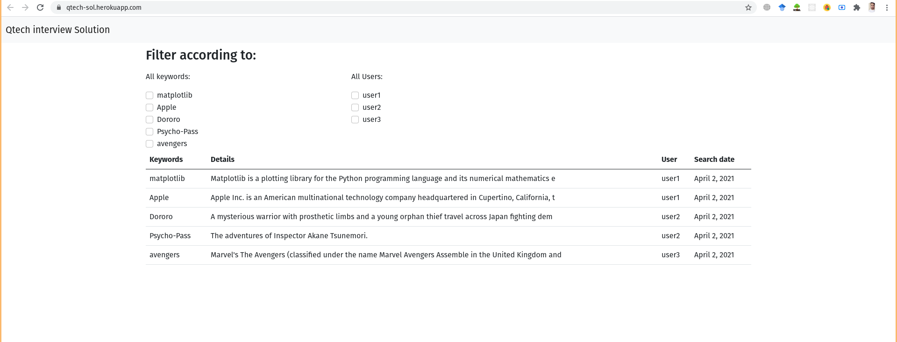

# Qtech interview question solution
### This repo contains the solution of the problem given by Qtech Solution Limited.

#### **Solution:** Used AJAX to asynchronically update page without refreshing page.

**Technology stack :** 
- Django
- HTML/CSS
- Bootstrap
- javascipt/Jquery/Ajax

**Installations :**

> git clone https://github.com/sayeedk06/qtech.git

>`pip install -r requirments.txt`

>python manage.py runserver

**View :**

>Visit the website at https://qtech-sol.herokuapp.com/ 